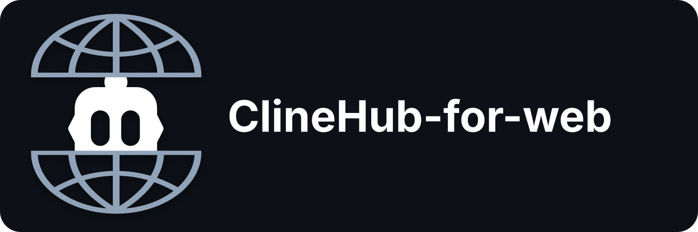

# ClineHub-for-web

Cline SDK の `ClineCore` をローカル実行基盤として利用し、ブラウザからセッションを操作する最小 Web UI です。

## 起動

Node.js 22 以上と pnpm を用意します。ローカルモデルを使う場合はモデルサーバー（LM Studio、llama.cpp、Ollamaのいずれか）も起動しておきます。ChatGPT ProのCodexを使う場合はブラウザーでChatGPTへログインできる状態にします。Claude Codeを使う場合はClaude Code CLIをインストールしてログインします。

```powershell
pnpm install
pnpm dev
```

ブラウザで http://localhost:3000 を開きます。

`pnpm dev` は既定で `0.0.0.0` にバインドするため、スマートフォンなど同じLAN上の他端末からも `http://<このPCのIP>:3000` でアクセスできます。認証機能はないため、信頼できないネットワークでは公開しないでください。localhostのみに限定する場合は起動前に指定します。

```powershell
$env:HOST = "127.0.0.1"
pnpm dev
```

起動時に接続設定画面が表示されます。

- Providerを選ぶ
- Server URLを確認・変更する
- `Fetch models` で使用可能なモデルを取得する
- Modelを選んで `Connect` を押す

既定URLは以下です。

- LM Studio: `http://192.168.8.223:1234`
- llama.cpp: `http://127.0.0.1:8080`
- Ollama: `http://127.0.0.1:11434`
- ChatGPT Pro / Codex: ChatGPT OAuthログイン（URL入力不要）
- Claude Code Pro / Max: ローカルのClaude Code CLIを使用（URL入力不要）

LM Studioでは現在ロード中のLLM、Ollamaではインストール済みモデル、llama.cppではモデル一覧APIの結果を表示します。ChatGPT Pro / Codexでは `Sign in with ChatGPT` を押してOAuth認証し、Cline SDKのサブスクリプション用モデル一覧から選択します。OpenAI PlatformのAPIキーや別料金のAPIクレジットは使用しません。

LM Studio、llama.cpp、Ollama、Claude Codeの接続先と選択モデルは`.cline-data/connection.json`へ保存し、サーバー再起動時に自動復元します。このファイルにはAPIキーや認証トークンを保存しません。Claude Codeの認証情報はClaude Code CLI側が安全に管理するため、CLIのログインが有効な間は再ログイン不要です。ChatGPT OAuthトークンはサーバーのメモリ内だけに保持するため、Codexは再起動後に再ログインが必要です。接続後もヘッダーの `AI settings` から変更でき、新しいセッションから反映されます。

## ログイン

既定ではログイン不要です。LAN上に公開する場合などにログインを必須にするには、`.env`（`.env.example`をコピー）へ `CLINEHUB_USER` と `CLINEHUB_PASSWORD` の両方を設定します。片方だけ設定した場合はログイン不要のままです。

```env
CLINEHUB_USER=alice
CLINEHUB_PASSWORD=hunter2
```

ログインするとhttpOnly Cookieでセッションを保持します（既定30日）。セッションはサーバーのメモリ内だけに保持するため、サーバー再起動で全員ログアウトになります。ヘッダーの`ログアウト`からいつでも手動ログアウトできます。この認証はシンプルな共有ログインで、複数ユーザーの個別アカウントやアクセス権の使い分けには対応していません。

## モデル／ワークスペースプロファイル

ヘッダーのラベル付き選択欄で、保存済みのモデルとワークスペースをすぐに切り替えられます。`プロファイル`画面は「モデル」と「ワークスペース」のタブに分かれています。ワークスペースではローカル作業フォルダーまたはSSH接続先を追加・編集でき、Local選択時はSSH/IP/認証項目を表示しません。モデルプロファイルは`AI設定`の「モデルプロファイル名」を付けて保存します。

SSHワークスペースには次を設定します。

- ホスト名またはIP、ポート、ユーザー名
- 接続先OS（Linux、macOS、Other Unix）
- Linux側の絶対ディレクトリ（例: `/home/user/project`）
- パスワード認証、またはサーバーPC上にある秘密鍵ファイルのパスと任意のパスフレーズ
- 任意のSHA256ホスト鍵フィンガープリント

保存時と切替時にSSH接続とリモートディレクトリを検査します。SSH選択中はClineのローカルファイル／コマンドツールを無効化し、SSH専用の読取、検索、コマンド、書込ツールを使います。読取・検索・書込パスは指定ディレクトリ配下に制限されます。コマンドは必ず指定ディレクトリから開始しますが、通常のシェルと同様にコマンド自身は他のパスへ移動できるため、`Agent settings`のコマンド権限を`確認`にすることを推奨します。

SSHパスワードと鍵パスフレーズはハッシュでは復元できないため、`.cline-data/profiles.json`へAES-256-GCMで暗号化して保存し、鍵を`.cline-data/profiles.key`へ分離します。秘密鍵ファイル自体はコピーしません。`.cline-data`はGit対象外です。ホスト鍵フィンガープリントを省略した場合は接続先の真正性を固定できない点に注意してください。

Linuxプロファイルではsudoを`使用禁止`、`毎回確認（推奨）`、`確認せず許可`から選択できます。sudoは通常コマンドとは別の`ssh_run_sudo_commands`として実行され、`毎回確認`ではコマンド内容をWeb画面で承認するまで開始しません。通常の`ssh_run_commands`に直接sudoを書いた場合は拒否します。sudo用パスワードは任意で、SSHパスワードとは別にAES-256-GCMで暗号化保存します。未設定の場合は接続先の`NOPASSWD`設定が必要です。

`確認せず許可`は、AIへリモート管理者権限を自動付与する危険な設定です。誤操作、データ消失、OS破損、セキュリティ事故について本アプリは安全性や復旧可能性を保証しません。UIでは警告表示と保存時の再確認を行います。

## Claude Codeで接続

Claude Code CLIをインストールし、ターミナルでログインします。

```powershell
claude auth login
claude auth status
```

`loggedIn: true`になったら、Web画面で次の順に操作します。

1. `AI settings`を開く
2. `Claude Code Pro / Max`を選ぶ
3. `Fetch models`を押す
4. `sonnet`、`opus`、`haiku`のいずれかを選ぶ
5. `Connect`を押す

Claude Code選択時はサーバーURLとAPIキーは不要です。このモードはClaude CodeをClineCoreのモデルバックエンドとして利用する構成で、ブラウザーUI、Clineのセッション履歴、working directory、Tool Approval、権限設定は引き続きClineHub-for-webが担当します。Claude Codeを直接ターミナルで使うだけなら本アプリは不要ですが、Web UIや他プロバイダーとの切り替えが必要な場合にこの構成を利用します。

内部ではCline SDKの`claude-code`プロバイダーと、公式Claude Agent SDKを橋渡しする`ai-sdk-provider-claude-code`を使用します。後者はコミュニティ提供のアダプターです。

ヘッダーの言語選択で日本語と英語を切り替えられます。選択した言語だけはブラウザーに保存されます。

ヘッダーの☀/☾ボタンでライトモードとダークモードを切り替えられます。選択はブラウザーに保存され、未選択時はOSのカラーテーマに従います。コンテキストバーは通常時が青〜紫、使用率75%以上が黄、自動圧縮ライン到達後が赤になります。

## Agent設定

ヘッダーには現在のworking directoryを常時表示します。`Agent settings` では以下を変更できます。

- Working directory（絶対パスで指定、既定では起動した場所以外も自由に選べます。詳細は後述）
- System prompt
- 最大iteration数（1〜500）
- Tool permissionプリセット
- `read_files`、`search_codebase`、`fetch_web_content`、`skills`、`run_commands`、`editor`、`apply_patch` の個別権限
- 自動コンテキスト圧縮の有効/無効、圧縮方式、保持する直近トークン数
- モデルのコンテキスト上限（通常は自動取得、必要な場合のみ手動指定）
- MCPサーバーの登録（後述）

権限は `Disabled`（モデルからも非表示）、`Ask`（Web承認が必要）、`Allow`（自動承認）の3段階です。プリセットは `Read only`、`Ask before changes`、`Full access` を用意しています。

`Agent settings` の `テンプレート` タブでは、System promptと権限プリセットをセットにした「テンプレート」を切り替えられます。標準では `日常`、`コーディング`、`プラン`、`Linux` の4種類があり、いずれも自由に編集・削除・既定値へのリセットが可能です。メッセージ入力欄のテンプレート切替からもワンクリックで変更でき、`プラン`を選んでいる間は「内容を確認し、実行する場合は`コーディング`に切り替えてください」というバナーを会話上部に表示します（一般設定で非表示にできます）。

エージェント設定を保存した後は、現在の会話履歴を保持した内部セッションへ切り替え、次に送信するメッセージからシステムプロンプト、権限、最大iteration数、圧縮設定、作業場所をまとめて反映します。設定は`.cline-data/agent-settings.json`へ保存され、サーバー再起動後も維持されます。

作業フォルダーは絶対パスで指定でき、既定では起動した場所以外も自由に選べます（存在するディレクトリであることのみ検証し、シンボリックリンクやジャンクションは実体パスに解決されます）。LAN上の他端末からもこのサーバーへアクセスできる構成など、選択できる範囲を1つのサブツリーに制限したい場合だけ、起動前に許可範囲を明示します。

```powershell
$env:CLINE_ALLOWED_ROOT = "E:\projects"
$env:CLINE_WORKSPACE_ROOT = "E:\projects\my-app"
pnpm dev
```

## コンテキスト表示と自動圧縮

会話上部に、直近のモデルリクエストで使用した入力トークン数、使用可能入力上限、使用率を表示します。累積使用量とは区別しており、セッション詳細では両方を確認できます。LM Studioはロード中インスタンスの `context_length`、Ollamaはモデル情報、llama.cppは `/props`、CodexはCline SDKのモデル情報から上限を取得します。取得できない場合はSDK既定の128,000を使用し、Agent設定から手動指定できます。

自動圧縮はCline SDK標準機能を使用します。SDK 0.0.75の発火位置は使用可能入力上限の90%固定です。設定画面では自動圧縮の有効/無効、`agentic`（AI要約）/`basic`、圧縮時に保持する直近トークン数を変更できます。

自動圧縮が実行されると、会話内に時刻付きイベントカードを表示し、コンテキストメーター下にも最終実行時刻と累計回数を表示します。履歴はセッションごとに`.cline-data/compactions.json`へ最大100件保存されるため、画面やサーバーを再起動した後も確認できます。セッション削除時には対応する圧縮履歴も削除します。

## MCPサーバー

`Agent settings` の `MCP` タブで、stdio・SSE・Streamable HTTPのMCPサーバーを登録できます。MCP全体のオン/オフはメッセージ入力欄のクイック権限（⛁アイコン）からもワンクリックで切り替えられます。サーバーごとにも有効/無効を切り替えられ、無効なサーバーは次のメッセージからClineのツール一覧に含まれません。

各カードの「接続テスト」ボタンは、保存前のフォーム内容のまま実際に接続します（stdioなら実際にコマンドを起動、SSE/HTTPなら実際にURLへ接続してツール一覧を取得）。stdioサーバーのテスト中に該当カードを削除すると、その場でプロセスを終了させてからカードを削除します。接続に成功すると、そのサーバーが公開しているツール名と説明の一覧が表示され、ツールごとにチェックボックスでモデルへの公開/非公開を切り替えられます。

MCPツールの呼び出しは既定でWeb画面の承認が必要です（会話ログとApproval表示は「⛁ MCP: サーバー名 → ツール名」の形で、AIが今MCPを呼び出そうとしていることが分かるように表示されます）。サーバーごとの「確認なしで許可」を有効にすると、そのサーバーのツール呼び出しは承認なしで実行されます。

3方式すべてを手元で試せる最小のテスト用MCPサーバーを `TEST-MCP-Server/` に用意しています。セットアップと、ClineHub-for-web側への具体的な登録内容は [TEST-MCP-Server/README.md](TEST-MCP-Server/README.md) を参照してください。

## Session管理

Session一覧の `⋯` から、状態、Provider、Model、working directory、開始・更新日時、token usage、messages fileを確認できます。Session名の変更と個別削除に対応しています。サイドバーの `Clear` では確認後に全Sessionを削除します。

ターン実行中に送信すると、そのメッセージは自動でキューに入り、現在のターンが終わり次第送信されます（送信欄から内容の修正・取消も可能）。応答が止まって進まなくなった場合は送信ボタンが「強制送信」に変わり、押すと現在のターンを中断してから、キューにあるメッセージ（今送ったものを含む）を後継セッションへ引き継いで実行します。会話履歴は保持されます。

## 構成

```
src/                        サーバー（Node / Hono）
  server.ts                 HTTP API と SSE エンドポイント
  runtime.ts                ClineCore の local runtime、セッション操作、イベント購読、Tool Approval 待ち
  providers.ts              プロバイダー別のURL正規化、モデル自動取得、接続設定
  mcp-extension.ts          MCP設定ファイルの生成と接続テスト
  stores/                   .cline-data/ への永続化
    agent-settings.ts       テンプレート、権限、圧縮設定
    connection-store.ts     接続先とモデルの復元
    profile-store.ts        モデル／ワークスペースプロファイルとSSH秘密情報の暗号化保存
    compaction-store.ts     自動圧縮の履歴
  workspace/                作業範囲の安全性
    workspace-security.ts   workspace root外への書き込み防止
    ssh-workspace.ts        SSH接続検査とリモートLinux用Clineツール

client/                     フロントエンド（React / Vite）
  main.tsx                  エントリ
  App.tsx                   画面全体の状態とSSE購読
  components/               画面部品
  hooks/                    再利用するReactフック
  lib/                      API、i18n、Markdown描画、メッセージログ、型
  styles/                   SCSS（後述）

tests/                      *.test.ts（pnpm test で一括実行）
scripts/                    dev.mjs（開発用watch）、build-client.mjs、run-tests.mjs、clear-sessions.ts
setting/language/           UIの言語ファイル（再ビルド不要で編集・追加可能）
dist/                       ビルド成果物（app.js、styles.css、index.html）。Git対象外
```

セッションデータはプロジェクト内の `.cline-data/` に保存します。Cline SDK の標準保存機構を利用しつつ、ユーザーのホームディレクトリへ書き込まない構成です。

## スタイル（SCSS）

見た目は `client/styles/` のSCSSから `dist/styles.css` へビルドします。`dist/` は生成物なので直接編集しません。

```
client/styles/
  main.scss          エントリ（読み込み順を定義）
  _tokens.scss       テーマの3色とそこから導出する全変数
  _base.scss         リセット、ボタン、フォーム、アニメーション定義
  _layout.scss       ヘッダー、サイドバー、コンポーザー
  _components.scss   セッション、ダイアログ、キュー、権限
  _messages.scss     会話バブルとMarkdown
  _responsive.scss   画面幅ごとの調整
```

配色はテーマごとに **main（操作色）／main-sub（情報色）／sub（中間色）** の3色だけを起点にし、背景・境界・文字色はすべてそこから導出します。`_tokens.scss` 冒頭の6つの値を変えるだけでテーマ全体が一貫して切り替わります。

## 実装済み

- ClineCore の local backend 起動
- セッション一覧・作成・履歴取得
- メッセージ送信
- `cline.subscribe()` による SSE ストリーミング
- Tool Approval の Approve / Reject
- Abort
- 起動時プロバイダー設定とモデル自動取得
- LM Studio、llama.cpp、Ollama、ChatGPT Pro / Codex、Claude Code Pro / Max対応
- OAuthトークンのメモリ内保持、自動更新、レスポンスからの秘匿
- Cline標準Tool Policyによる権限プリセット・個別承認設定
- System prompt、working directory、最大iteration数の設定
- Session詳細、使用量、名前変更、個別削除、一括削除
- 日本語/英語UI、現在のコンテキスト使用率とモデル上限の表示
- Cline SDK標準の自動コンテキスト圧縮設定
- thinking/reasoning、通常回答、Tool履歴の構造を保ったセッション再表示
- ファイル読取・検索・コマンド・編集の実行状況カード、折りたたみ式の結果全文、内部Toolの表示切替
- SDK 標準のセッション永続化・組み込みツール・設定探索の利用
- モデル／ローカル／SSHワークスペースプロファイルの保存と即時切替
- パスワードまたは秘密鍵によるSSH接続、リモートコマンド・読取・検索・書込
- System prompt・権限プリセットをセットにしたテンプレート（モード）切替
- 実行中メッセージの自動キュー、キューの修正・取消、強制送信
- stdio / SSE / Streamable HTTP対応のMCPサーバー登録、接続テストとツール一覧表示、サーバー単位・ツール単位の有効/無効、サーバー単位の確認なし許可、MCP全体のクイックオン/オフ
- MCPツール呼び出しの承認要求・実行状況を「MCP: サーバー名 → ツール名」として会話ログ・Approvalに明示
- ワークスペースの絶対パス指定（既定では起動フォルダー配下に限定しない）
- `.env`によるオプトインのログイン機構（未設定なら従来通りログイン不要）

## 既知の制限

- ChatGPT OAuthのコールバックは `localhost:1455` を使用します。他のプロセスがこのポートを使用している場合はログインできません。
- Claude Code連携はClaude Code CLIとコミュニティ提供のAI SDKアダプターを経由します。Claude Code CLIの仕様変更時にはアダプターの更新が必要になる場合があります。
- ChatGPT Pro / CodexのOAuth資格情報は永続化していません。永続化する場合はハッシュではなく、Windows資格情報マネージャーなどOSの安全な資格情報ストアへの対応が必要です。
- `.env`でのログインは単一の共有ユーザー/パスワードのみで、複数ユーザーの個別アカウントやアクセス権の使い分けには対応していません。`pnpm dev` は既定でLAN上の他端末からアクセスできる構成のため、信頼できないネットワークではログインを設定するか、`HOST=127.0.0.1` に限定してください。
- セッション作成ボタンは空の interactive session を開始します。最初のメッセージ送信時に prompt を渡すこともできます。
